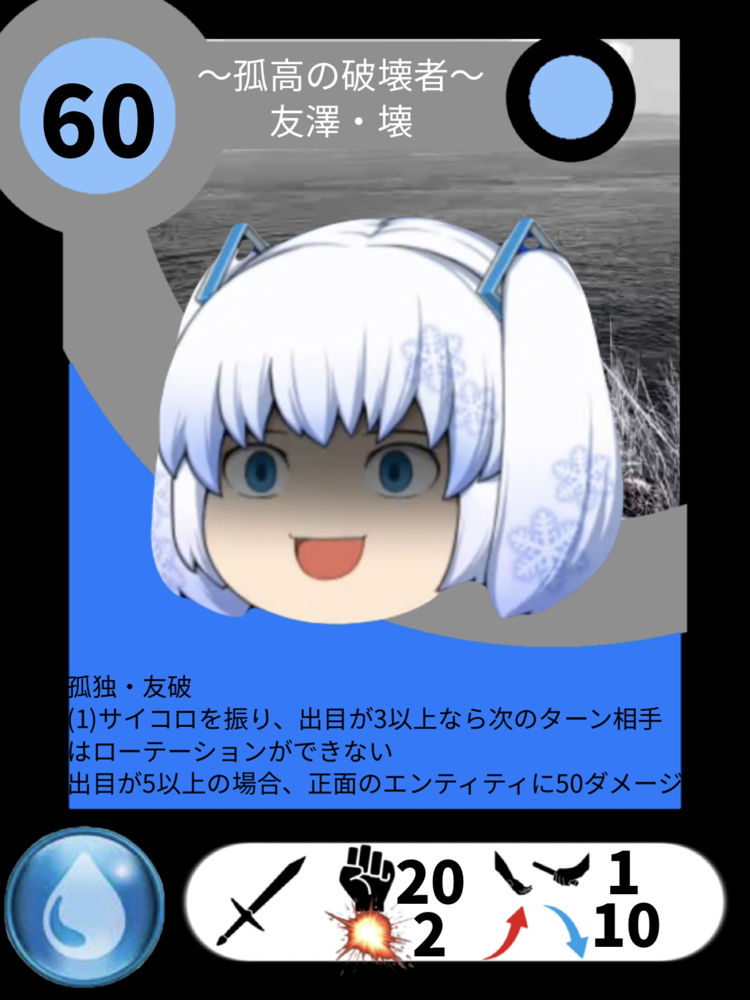
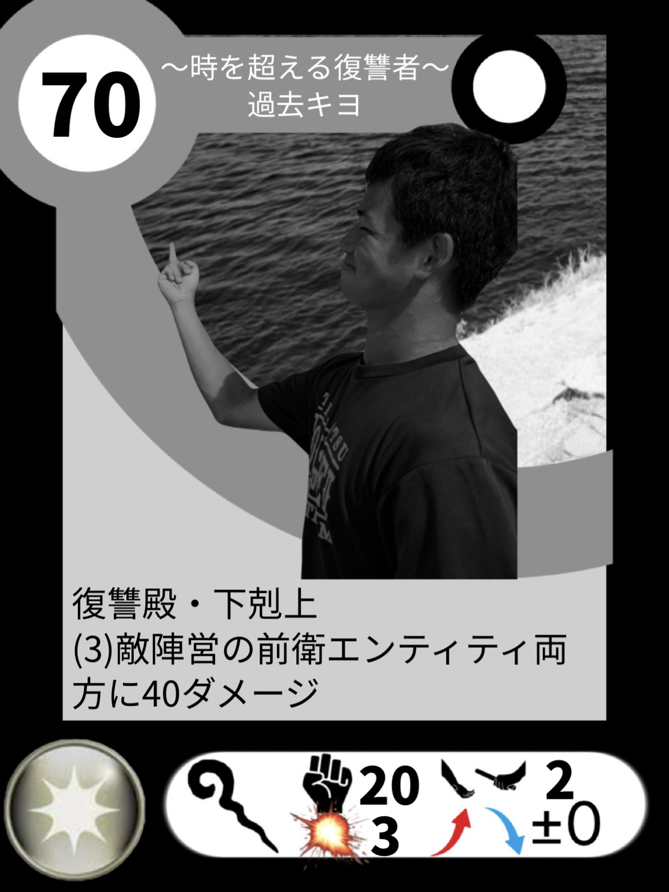
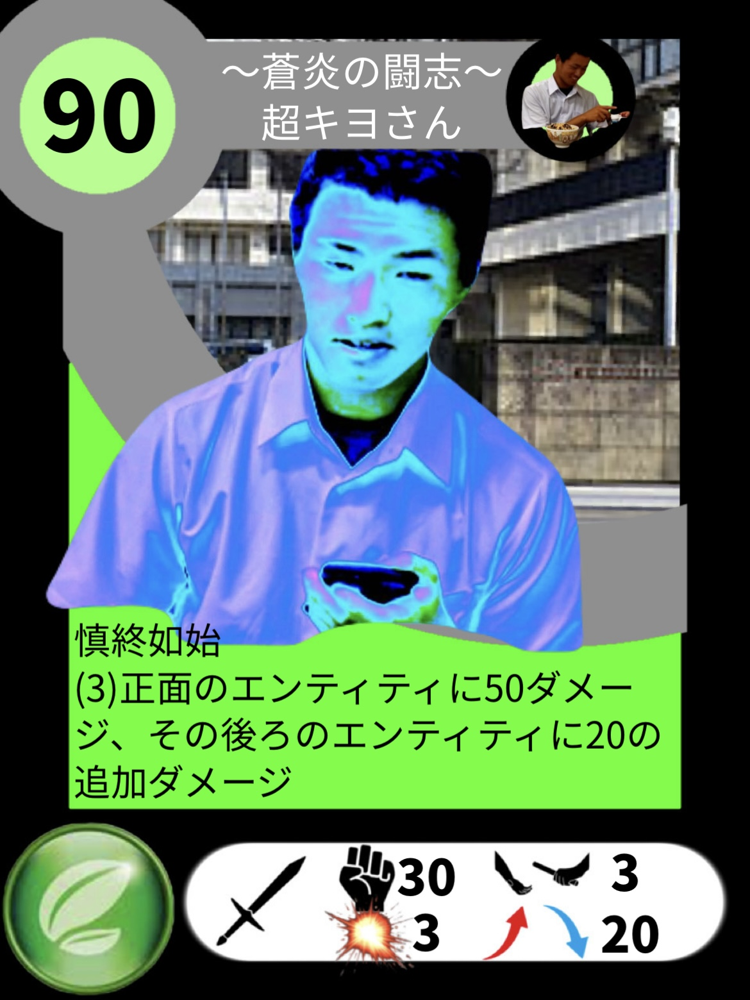
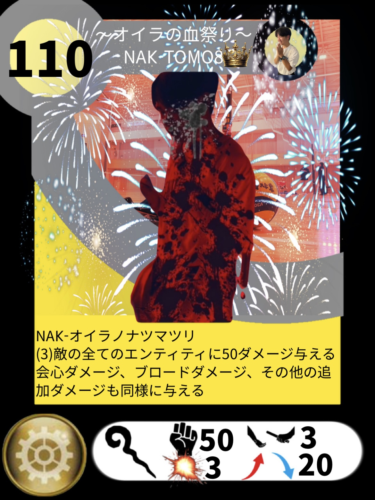

<!DOCTYPE html>
<html lang="ja">
<head>
  <meta charset="UTF-8">
  <title>ウィークリーキャラクター人気投票</title>
  
</head>
<body>

  <h1>ウィークリーキャラクター 人気投票</h1>

  

  

    

      
      <button onclick="submitVote('キャラクターA')">キャラクターAに投票</button>
    

    

      
      <button onclick="submitVote('キャラクターB')">キャラクターBに投票</button>
    

    

      
      <button onclick="submitVote('キャラクターC')">キャラクターCに投票</button>
    

    

      
      <button onclick="submitVote('キャラクターD')">キャラクターDに投票</button>
    

  

  

    <h2>先週の結果</h2>
    

      

        
        
1位：友澤

      

      

        
        
2位：過去キヨ

      

      

        
        
3位：キヨさん

      

      

        
        
4位：NAK-01ra

      

    

  

  

</body>
</html>
